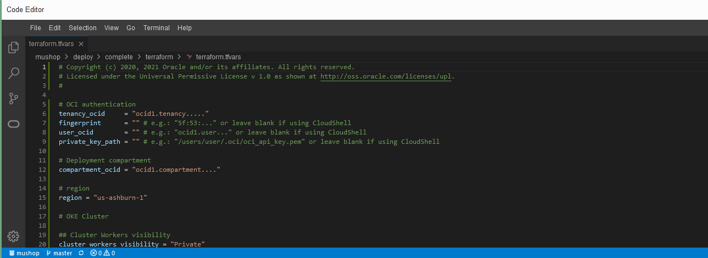
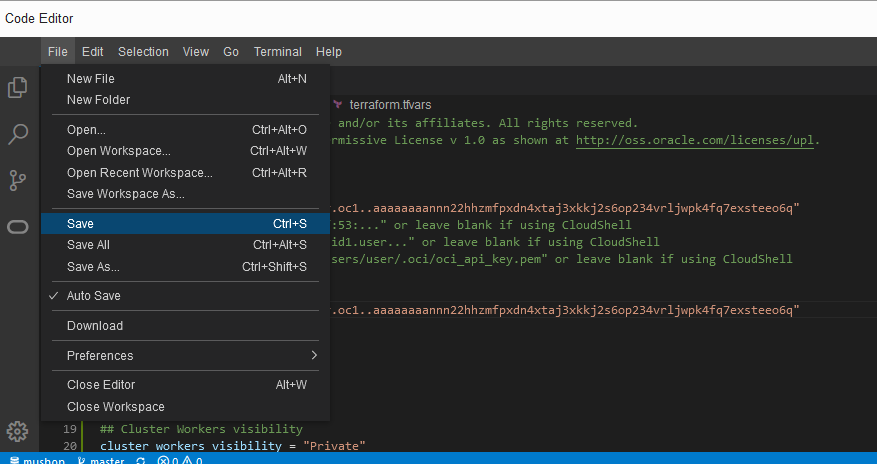
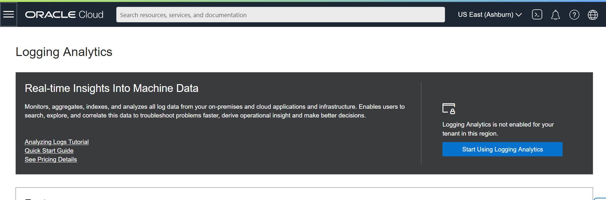
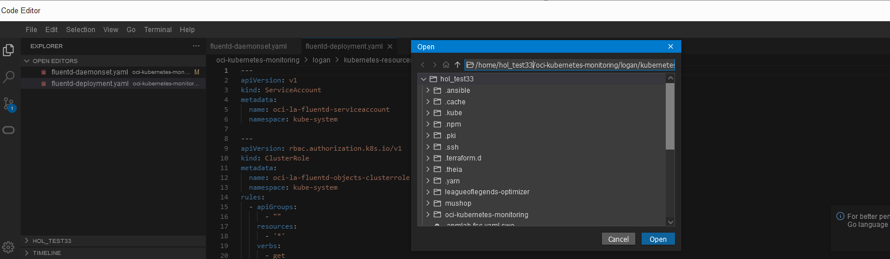

# Observability for Mushop
 # Introduction


## About 

In this Project I'm showing a step by step tutorial to configure the **[Monitoring Solution for Kubernetes](https://github.com/oracle-quickstart/oci-kubernetes-monitoring)**

The purpose behind the project is deploy a monitoring solution for MuShop Application which is deployed on Kubernetes, showcasing Oracle Cloud Native technologies and backing services. 

MuShop is a showcase of several Oracle Cloud Infrastructure services in a unified reference application. The sample application implements an e-commerce platform built as a set of micro-services. The accompanying content can be used to get started with cloud native application development on Oracle Cloud Infrastructure.

You can find the main project for deploying the Mushop at this **[link](https://github.com/oracle-quickstart/oci-cloudnative)**!
Also, you can find the source project of this tutorial at this **[link](https://github.com/oracle-quickstart/oci-kubernetes-monitoring)**!
### Objectives


### Prerequisites

-  This tutorial requires an Oracle Cloud account with available credits, you may check out this **[video](https://www.youtube.com/watch?v=4U-0SumNz6w)** to help you signing up. You also can use a paid cloud account or a trial cloud account as well.
  


## Task 1: Infrastructure Configuration

 First, we will build the infrastructure that we will use to run the rest of the workshop.  The sample application is a showcase of several Oracle Cloud Infrastructure services in a unified reference application. It implements an e-commerce platform built as a set of micro-services. The accompanying content can be used to get started with cloud native application development on Oracle Cloud Infrastructure.

 Let's start by obtaining the Mushop source code, the application code as well as the Terraform code, that creates all the required resources and configures the application on the created resources.

- After you sign in into you tenant, open up the Cloud Shell and clone the github repo.

```
git clone https://github.com/oracle-quickstart/oci-cloudnative.git mushop
```


```
cd mushop/deploy/complete/terraform/
terraform init
```


- Copy the template variable file, and before we apply the infrastructure with terraform, we need to set some variables, so to do so open the code editor:
```
cp terraform.tfvars.example terraform.tfvars
```


- To open the terraform.tfvars file, click File>Open, and edit the path by addin the following extension 
```
/mushop/deploy/complete/terraform/terraform.tfvars
```


- Get the values from the Cloud Shell and copy them to the Code Editor
Region:
```
echo $OCI_REGION
```
Tenancy:
```
echo $OCI_TENANCY
```

- If you aren't using the root compartment you can find Compartment ocid in from cloud shell as follows, replace <COMPARTMENT_NAME> by the name of the compartment.

    ```
    <copy>
    oci iam compartment list \
      --all \
      --compartment-id-in-subtree true \
      --query 'data[0].id' \
      --name <COMPARTMENT_NAME>
    </copy>
    ```
- Save the file


- Run the Terraform apply:
    ```
    <copy>
      terraform apply -auto-approve
    </copy>
    ```
- After 10 to 20 minutes the resources should be created.

 You will see something like this:


Note: if you get an error that could be due to the continous changes and updates applied on the Oracle Cloud, so mainly check if the basic resources are created such as (OKE Cluster, Compute Instances, DB instance, VCN), if those resources are there you can proceed in this lab then.


## Task 2: Logging Analytics

- To start off with Logging Analytics the  Service must be enabled in the given OCI region as following 





Now to be able to start ingest data into O&M services we need  set some policies 
- From the Menu > Identity & Security >Policies


As you can see the terraform has created a dynamic group that include all the relevant OCI instances 
- Click mushop-tenancy-policies-LNWU> Edit Policy Statements


- Click + Another Statement, make sure you change the dynamic group name and use the one in the above statement also for user group you can can use Adminstrators if you are using the trial.
```
Allow dynamic-group <dynamic_group_name> to {LOG_ANALYTICS_LOG_GROUP_UPLOAD_LOGS} in tenancy
Allow group <user_group_name> to {LOG_ANALYTICS_LOG_GROUP_UPLOAD_LOGS} in tenancy


```

 Note: As I'm using root compartment, I will be adding the policies for a tenancy wise for the workshop purpose, but for production as you might have different compartments and group you can adjust the statement based on the relevant ones.
   

## Task 3: Install the Helm

 Back to the Cloud shell download the source code for the helm chart

```
 git clone https://github.com/oracle-quickstart/oci-kubernetes-monitoring.git
```


```
Cd oci-kubernetes-monitoring 
```
- Docker Image
We will be using this pre-built image to create a custom image using this image as a base image it includes all the required dependencies. 
```
docker pull fra.ocir.io/fruktknlrefu/fluentd_oci_la:20220307
```


- Deploying Kuberenetes resources using Kubectl

The Kubernetes resources can be found in kubernetes-resources directory, these yaml files inside it needs to be applied using kubectl to create the necessary resources that enables the logs collection into Logging Analytics through a Fluentd based DaemonSet. As you scrollm down to line 69you see that we need to replace some information related to the OKE cluster, log group…make sure you save those info on a local text file as we will need them again later in the object collection

- To enable Logs collection, Open code editor and add the following path to access the fluentd file for logs collection
```
/oci-kubernetes-monitoring/logan/kubernetes-resources/logs-collection/fluentd-daemonset.yaml
```


- First we will add the Image URL which is in this case 
```
fra.ocir.io/fruktknlrefu/fluentd_oci_la:20220307
```


Then we need to get log group id which refers to the logging analytics log group

- From the menu>Observability & Management>Logging Analytics>Administration>Log Groups


- Click on log groups>default, copy OCID and paste it in the code editor


- On the top right corner click on profile button and select Tenancy, under the Object storage settings copy the Object storage namespace and paste it to the code editor


- Now to get the OKE related information, go to the Kubernetes cluster created earlier and copy Cluster Id and cluster name and finally paste them into the code editor 


- Save the file from File>Save


- Back to the cloud shell above 
```
cd kubernetes-resources/logs-collection/
```
- To apply those yaml files with kubctl make sure you are accessed to the OKE cluster created earlier in task 1.


- Apply the yaml files in the sequence of configmap-docker.yaml(or configmap-cri.yaml), secrets.yaml (not required for default auth type) and fluentd-daemonset.yaml.

```
 kubectl apply -f configmap-docker.yaml 
 
 kubectl apply -f secrets.yaml 

 kubectl apply -f fluentd-daemonset.yaml 
```


- To enable Kubernetes Objects collection, open the following path from the Code Editor 
```
/oci-kubernetes-monitoring/logan/kubernetes-resources/objects-collection/fluentd-deployment.yaml
```


- Scroll down till line 76 and fill in with the information collected earlier for the log collection

    Image URL
    Log Group ID
    Tenancy Namespace
    Kubernetes Cluster OCID
    Kubernetes Cluster Name

And finally save the changes.


- Back to the cloud shell
```
Cd ..
cd objects-collection/
kubectl apply -f configmap-objects.yaml 
kubectl apply -f fluentd-deployment.yaml 
```


- Deploying Kuberenetes resources using Helm, first install helm
```
cd ..
cd ..
cd helm-chart/
git clone https://github.com/helm/helm.git
cd helm
make
```


- From the Code Editor we need to open the values.yaml and add the info we added earlier to fluentd, the path to the file is:
```
/oci-kubernetes-monitoring/logan/helm-chart/values.yaml
```


- Back to the Cloud shell run the following:
```
helm install <release-name> --values <path-to-external-values.yaml> <path-to-helm-chart>
```
- Finally, after you install the helm release you can browse to the Logging Analytics to see that data started to load.


If you want to discover the Logging Analytics capabilities (Machine learning Analysis, Visualizations, Dashboards) you can check this **[project](https://github.com/RawanAk/OMWorkshop/blob/main/logana/logana.md)** where i explained in details those pionts.

## Task 4: Destroy the resources

- Use the following helm uninstall command to delete the chart. Provide the release name used when creating the chart.
```
helm uninstall <release-name>
```
- Clean Up MuShop cluster, from the Cloud Shell run the following:

```
cd ~
cd mushop/deploy/complete/terraform/
terraform destroy
```


